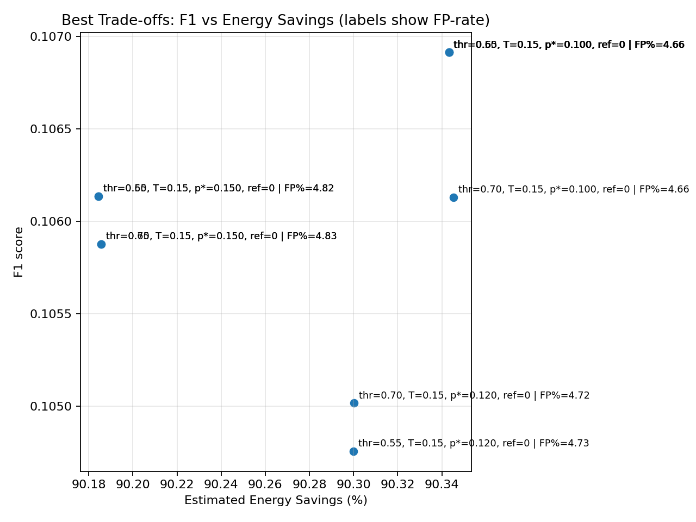

# Sundew Algorithm
**Energy-Aware Selective Activation for Edge AI Systems**

[](https://opensource.org/licenses/MIT)
[](https://www.python.org/downloads/)
[](https://github.com/psf/black)

<p align="center">
  <a href="results/plots/best_tradeoffs.png">
    
  </a>
  <a href="results/updates/2025-09-ecg-mitbih.md">
    
  </a>
  <a href="#-presets">
    
  </a>
</p>

> ### ⭐ Featured Preset: `ecg_mitbih_best`
> **Frozen from MIT-BIH sweep** for a practical precision–recall–savings trade-off.  
> - `activation_threshold = 0.65` · `gate_temperature = 0.15` · `target_activation_rate = 0.10` · `refractory = 0`  
> - See **plot**: [best_tradeoffs.png](results/plots/best_tradeoffs.png)  
> - See **notes & settings**: [2025-09 ECG MIT-BIH Update](results/updates/2025-09-ecg-mitbih.md)

#### Quick start (ECG best)
```bash
python -m benchmarks.run_ecg \
  --csv "data/MIT-BIH Arrhythmia Database.csv" \
  --preset ecg_mitbih_best \
  --limit 50000 \
  --save results/real_ecg_best.json
```

> *"Nature's wisdom, encoded in silicon."*

A bio-inspired, event-driven intelligence system designed for resource-constrained AI applications. Sundew implements adaptive selective activation to optimize energy consumption while maintaining processing quality on edge devices.

## Overview

### ✅ Real-Dataset Validation (MIT-BIH Arrhythmia)

We evaluated **Sundew** on the **MIT-BIH Arrhythmia Database** (PhysioNet; ~50k rows; binary abnormal-beat labels) using preset **`ecg_v1`** and a 108-point grid sweep over threshold/temperature/targets.

- **Energy savings (median across sweep):** ~90.8% (min 90.18%, max 91.31%)
- **Top configuration selection:** constrained by savings ≥ 88%, FN ≤ 9000, FP-rate ≤ 0.08; ranked by **F1, then precision**
- Artifacts:
  - CSV: [`results/best_by_counts.csv`](results/best_by_counts.csv)
  - Markdown: [`results/best_by_counts.md`](results/best_by_counts.md)
  - Research note: [`results/updates/2025-09-ecg-mitbih.md`](results/updates/2025-09-ecg-mitbih.md)

> Reproduce:
> ```bash
> python -m benchmarks.sweep_ecg --csv "data/MIT-BIH Arrhythmia Database.csv" \
>   --out results/sweep_cm.csv --preset ecg_v1 --limit 50000
>
> python -m benchmarks.select_best \
>   --csv results/sweep_cm.csv \
>   --out-csv results/best_by_counts.csv \
>   --out-md results/best_by_counts.md \
>   --research-md results/updates/2025-09-ecg-mitbih.md \
>   --dataset-name "MIT-BIH Arrhythmia Database" \
>   --dataset-notes "CSV from PhysioNet; ~50k rows; binary abnormal-beat labels; ecg_v1 sweep." \
>   --min-savings 88 --max-fn 9000 --max-fp-rate 0.08 \
>   --sort f1,precision --top-n 20 --describe
> ```

The Sundew Algorithm addresses a critical challenge in edge AI: **when to process events** in energy-constrained environments. Instead of processing every input, Sundew intelligently selects which events deserve computational attention based on their significance and available energy resources.

### Key Capabilities

- **Bounded Significance Scoring**: Convex combination of lightweight feature extractors
- **Temperature-Controlled Gating**: Soft gating during analysis, hard thresholding at inference
- **Adaptive Thresholding**: PI-style controller with energy-aware pressure adjustment
- **Energy Accounting**: Transparent comparison between baseline and actual energy consumption
- **Minimal Dependencies**: Pure Python implementation with minimal overhead

### Use Cases

| Domain | Application Examples |
|--------|---------------------|
| **Healthcare** | Continuous patient monitoring, wearable devices |
| **Security** | Smart surveillance, anomaly detection systems |
| **Robotics** | Duty-cycled perception, autonomous navigation |
| **Aerospace** | Remote sensing, space-constrained operations |
| **Neuromorphic** | Event-driven computing architectures |

## Installation & Quick Start

### Prerequisites
- Python 3.8 or higher
- Virtual environment (recommended)

### Installation

```bash
# Create and activate virtual environment
python -m venv sundew-env
source sundew-env/bin/activate  # On Windows: sundew-env\Scripts\activate

# Install package
pip install -U pip
pip install -e .
```

### Quick Demo

```bash
# Run demonstration with synthetic data
python -m sundew.cli --demo --events 40 --temperature 0.1 --save results.json
```

**Temperature Parameter Guide:**
- `--temperature 0`: Hard gating (production/inference mode)
- `--temperature 0.1-0.3`: Soft gating (analysis and exploration)

## Algorithm Design

### Core Mechanism

The Sundew Algorithm operates through four main stages:

#### 1. Significance Scoring
Events are assigned bounded significance scores using a weighted combination of features:

```
s = Σ wᵢ fᵢ(x)    where s ∈ [0,1]
```

#### 2. Temperature-Controlled Gating
Activation probability is computed using a temperature-controlled sigmoid:

```
p = σ((s - θ) / τ)
activate ~ Bernoulli(p)
```

Where:
- `τ → 0`: Hard thresholding (inference mode)
- `τ > 0`: Soft gating (exploration mode)

#### 3. Adaptive Threshold Control
The activation threshold adapts using PI control with energy pressure:

```
θ ← clip(θ + η(p* - p̂) + λ(1 - E/Eₘₐₓ))
```

Where:
- `p*`: Target activation rate
- `p̂`: Exponential moving average of recent activations
- `E/Eₘₐₓ`: Normalized energy reserve

#### 4. Energy Accounting
The system tracks and compares actual energy consumption against a baseline (always-on) scenario, providing transparent energy savings metrics.

## Usage

### Programmatic API

```python
from sundew import SundewAlgorithm, SundewConfig
from sundew.demo import synth_event

# Configure algorithm
config = SundewConfig(
    gate_temperature=0.0,        # Hard gating for inference
    target_activation_rate=0.25, # Process ~25% of events
    energy_pressure_weight=0.1,  # Energy-aware adaptation
    threshold_learning_rate=0.01 # Adaptation speed
)

# Initialize algorithm
algorithm = SundewAlgorithm(config)

# Process events
for i in range(100):
    event = synth_event(i)
    result = algorithm.process(event)
    
    if result is not None:
        print(f"Event {i} processed: {result}")
    else:
        print(f"Event {i} skipped")

# Generate performance report
print(algorithm.report())
```

### Configuration Presets

The system includes several pre-tuned configurations:

- **`baseline`**: Conservative settings for stable operation
- **`tuned_v2`**: Balanced performance and efficiency
- **`aggressive`**: Maximum selectivity for extreme energy constraints
- **`energy_saver`**: Optimized for battery-powered devices

## Benchmarking & Analysis

### Single Run Analysis

Generate detailed time-series analysis and CSV output:

```bash
python benchmarks/plot_single_run.py \
  --preset tuned_v2 \
  --events 400 \
  --out results/plots_tuned \
  --savecsv results/single_run.csv
```

### Multi-Preset Comparison

Compare multiple configurations across repeated runs:

```bash
# Generate comparison data
python benchmarks/run_presets.py \
  --events 300 \
  --repeats 3 \
  --presets baseline tuned_v2 aggressive energy_saver \
  --out results/comparison.csv

# Plot comparative results
python benchmarks/plot_grid.py \
  --csv results/comparison.csv \
  --out results/comparison_plots
```

### Key Performance Metrics

| Metric | Description |
|--------|-------------|
| `total_inputs` | Total events processed |
| `activations` | Number of events that triggered processing |
| `activation_rate` | Proportion of events processed |
| `ema_activation_rate` | Smoothed activation rate |
| `actual_energy_cost` | Measured energy consumption |
| `baseline_energy_cost` | Energy cost of always-on processing |
| `estimated_energy_savings_pct` | Relative energy savings |

## Project Structure

```
sundew_algo/
├── src/sundew/              # Core implementation
│   ├── core.py             # Main algorithm
│   ├── config_presets.py   # Pre-defined configurations
│   └── demo.py             # Synthetic data generator
├── benchmarks/             # Performance evaluation
│   ├── grid_search.py      # Parameter optimization
│   ├── run_presets.py      # Multi-config benchmarking
│   ├── plot_grid.py        # Comparative visualization
│   └── plot_single_run.py  # Single-run analysis
├── results/                # Output data and plots
├── tests/                  # Unit test suite
├── .github/workflows/      # CI/CD configuration
├── CITATION.cff           # Citation metadata
└── CONTRIBUTING.md        # Contribution guidelines
```

## Contributing

We welcome contributions in the following areas:

- **Algorithm Improvements**: New control strategies, optimization techniques
- **Energy Models**: More sophisticated energy consumption models
- **Benchmarking**: Additional datasets and evaluation metrics
- **Visualization**: Enhanced plotting and analysis tools
- **Documentation**: Tutorials, examples, and guides

Please see [CONTRIBUTING.md](CONTRIBUTING.md) for detailed guidelines.

## Citation

If you use Sundew in your research, please cite:

```bibtex
@software{Idiakhoa2025Sundew,
  author       = {Idiakhoa, Oluwafemi},
  title        = {Sundew Algorithm: Bio-Inspired Event-Driven Intelligence},
  year         = {2025},
  url          = {https://github.com/oluwafemidiakhoa/sundew_algo},
  note         = {Open-source prototype, MIT License}
}
```

Citation metadata is also available in [CITATION.cff](CITATION.cff).

## License

This project is licensed under the MIT License - see the [LICENSE](LICENSE) file for details.

## Contact

**Oluwafemi Idiakhoa**
- Email: oluwafemidiakhoa@gmail.com
- ORCID: [0009-0008-7911-1171](https://orcid.org/0009-0008-7911-1171)

---


*Inspired by nature, engineered for efficiency*
